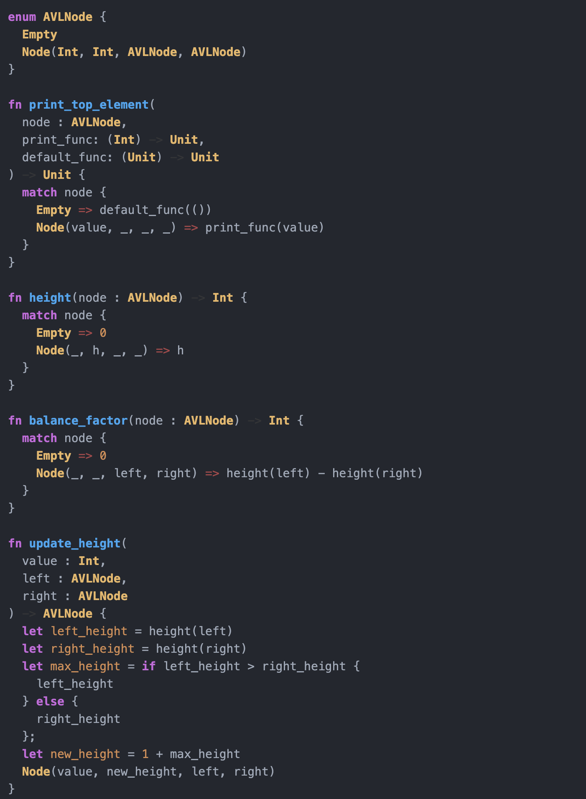

# highlightjs-moonbit

MoonBit language support for [highlight.js](https://highlightjs.org/).



## Usage

### Static Website or Simple Import

```html
<script type="text/javascript" src="/path/to/highlight.min.js"></script>
<script type="text/javascript" src="/path/to/moonbit.min.js"></script>
<script type="text/javascript">
  hljs.highlightAll();
</script>
```

### With Node or Webpack

```javascript
const hljs = require('highlight.js');
const moonbit = require('highlightjs-moonbit');

hljs.registerLanguage('moonbit', moonbit);
```

## Development

```bash
npm install
npm run build
```
